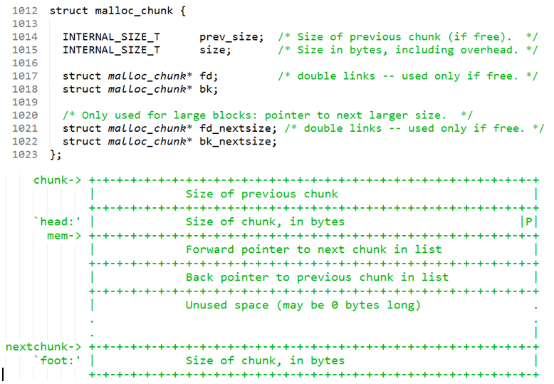
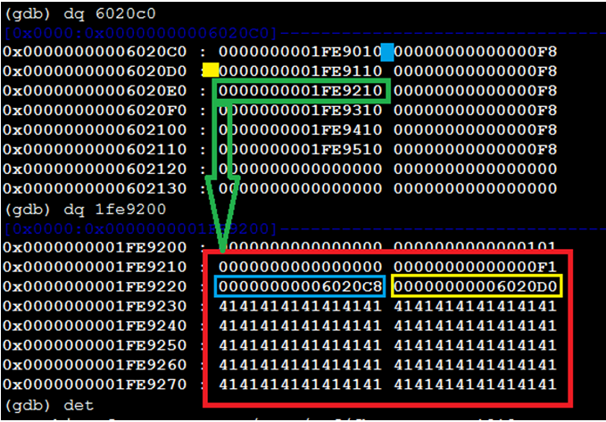
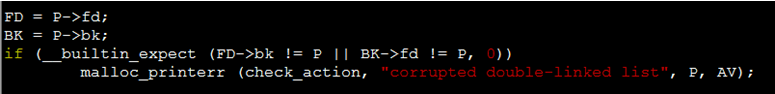
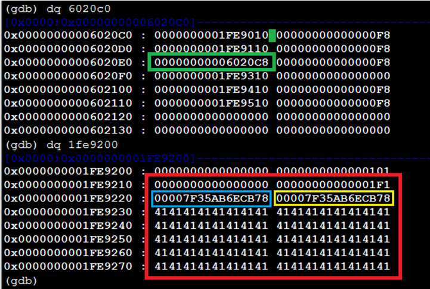
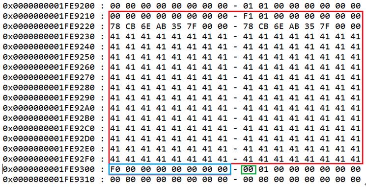
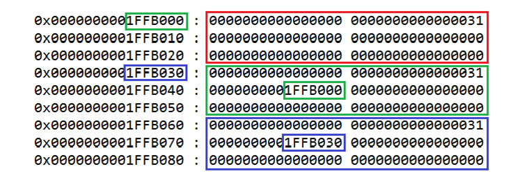
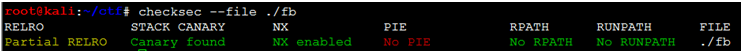

# Linux heap chunk corruption 

author : [@55-AA](https://twitter.com/5_5_A_A), Sept 18, 2016

##Introduction

In this post, I demonstrate corrupting the heap chunk leveraging unlink action on Linux x64.

## Basic terms

+ FastBin: the chunk block allocated size < 0x88
+ SmallBin: the chunk block allocated size >= 0x88

The following is the chunk define:

# SmallBin Unlink corruption stages：

1. Allocate two memory p0 and p1 at heap, the size are 0xf8 bytes.
2. Build fake chunkX in p0, it requires a pointer within write-able section point to the chunkX.
3. Write the p0 to overwrite the chunk header of p1, that makes heap allocator believe that the fake chunkX is free.
4. Release the p1 to trigger a coalescing from p1 chunk to p0 chunk, that cause the unlink operation of p0 chunk.

Before the unlink, the fake chunk in following:

As above figure, the green Section value must point to the Fake chunkX (red section). In the fake chunkX:
    
    00000000000000F1 & 3 = 1

It specifies the front chunk is in use.

    00000000000000F1 & (~3) = F0

It specifies the current chunk size 0xf0 bytes.

The first 0000000000000000 specifies the front chunk is 0 bytes.

The blue section is the free list's FD(Forward Pointer), it point to p3-0x18, just the chunkA.

The yellow section is the free list's BK(Back Pointer), it pointer to p3-0x10, just the chunkB.

chunkB'BK and chunkB'FD are overlapped, and both two point to the chunkX.

Due to the green section data, it can bypass the following check when unlink done.

After free(p1) called, the heap layout in following:

In the above figure, the green section is just the available value after corruption. The blue and yellow section pointer to the free list top, these address are located in libc, so they can be used to leak the heap layout information.

Above figure demonstrates the chunkX condition after corruption. Contrasting corruption before, there are only three DWORDs modified, they are 1FE9218,1FE9220 and 1FE9228. The 1FE9218 is the size of two chunks combined. The 1FE9228 is the free list' FD, and the 1FE9220 is the BK.

The address 1FE9200 is the chunk0, 1FE9300 is chunk1, and 1FE9200 is the fake chunkX. Releasing chunk1 causes an unlink action about chunkX.

The green 00 is just the overflow byte. The value of blue section must be equal to the red section size, this need be prepared before unlink action. The blue section is a region overlapped by chunk1, it is the chunk0's size(set by malloc parameter).

## Fastbin leveraging

After Fastbin released, it was stored in a singly linked list. Only the FD field was used. According to the FIFO(first-in first-out) rule, the next allocating fetch the last one from list and modify the FD pointer.

In the above figure, after 0000000001FFB030 replaced with 000000000xxxxxxx, the returned value by called malloc(0x40) is 0x0000000001FFB070, the returned value by re-called malloc(0x40) is just 0x000000000xxxxxxx。

## Experiment Environment

+ Debian 4.3.3-5kali4 (2016-01-13) x86_64 GNU/Linux
+ CentOS release 6.5, 2.6.32-431.el6.x86_64

## Execution Bin

+ ./bin/fb
+ ./writeup.py

##References

https://github.com/lattera/glibc/blob/master/malloc/malloc.c